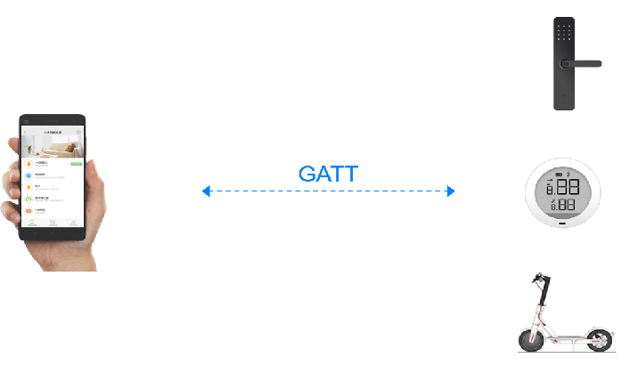
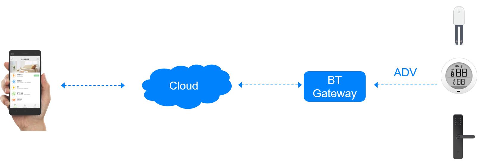

# 米家BLE接入介绍

​根据产品的安全等级、是否支持Mesh等特性，平台提供三种不同的接入方式：标准BLE接入、高安全级BLE接入、BLE Mesh接入。三种接入方式各有特点，平台会提供相应的固件端软硬件支持，完成设备的认证，帮助产品接入到米家APP中。

​对于普通安全级别的产品，如温湿度传感器，可采用标准LE方式接入，无须提前烧写预置安全秘钥或增加安全芯片，开发更便捷。

​对于高安全级别的产品，如蓝牙智能门锁，可采用高安全级BLE方式接入，必须搭配安全芯片使用，同时配合pin code OOB认证。

BLE Mesh接入是较新的技术，更多介绍请直接参考[米家BLE Mesh接入介绍](https://github.com/MiEcosystem/miio_open/blob/master/ble/08-%E7%B1%B3%E5%AE%B6BLE%20Mesh%E6%8E%A5%E5%85%A5%E4%BB%8B%E7%BB%8D.md)。

 

## 标准BLE接入

通过标准BLE方式接入后，设备将获得如下能力：
1. 设备获得由米家服务器分配的唯一Device ID，并绑定在登陆米家APP的账号下。
2. 设备可以与米家App建立GATT连接，传递数据。
3. 设备可以发送包含事件或属性信息的MiBeacon。米家所有BLE网关都可以接收MiBeacon并转发给米家服务器。后续可以根据存储在米家服务器的事件或属性信息在APP上显示或进行自动化配置。如何使用MiBeacon广播事件或属性请参考[米家BLE MiBeacon协议](https://github.com/MiEcosystem/miio_open/blob/master/ble/02-%E7%B1%B3%E5%AE%B6BLE%20MiBeacon%E5%8D%8F%E8%AE%AE.md)。**严格遵守注意事项**。
4. 设备可以在同一小米账号下的多个手机上使用。
5. 设备可以被安全分享至另外的小米账号。
6. 设备可以通过米家APP进行OTA。

基于GATT的数据传输

基于MiBeacon的数据传输

更多内容，请参考[米家标准BLE接入产品开发](https://github.com/MiEcosystem/miio_open/blob/master/ble/04-%E7%B1%B3%E5%AE%B6%E6%A0%87%E5%87%86BLE%E6%8E%A5%E5%85%A5%E4%BA%A7%E5%93%81%E5%BC%80%E5%8F%91.md)。

## 高安全级BLE接入

此类接入可以提供更高的安全等级：
1. 必须使用米家安全芯片，安全芯片可以保证设备是小米认证过的设备。
2. 每次绑定都会生成一个新的长期密钥(根密钥)，每次连接都会生成一个新的会话密钥。
3. 高安全级接入可以应对重放攻击、窃听攻击、中间人攻击、垃圾桶攻击、暴力破解等一系列攻击手段，最大程度保证设备安全。
4. 高安全级接入设备也可以通过GATT和MiBeacon方式传递数据。

更多内容，请参考[米家高安全级BLE接入产品开发](https://github.com/MiEcosystem/miio_open/blob/master/ble/06-%E7%B1%B3%E5%AE%B6%E9%AB%98%E5%AE%89%E5%85%A8%E7%BA%A7BLE%E6%8E%A5%E5%85%A5%E4%BA%A7%E5%93%81%E5%BC%80%E5%8F%91.md)。
