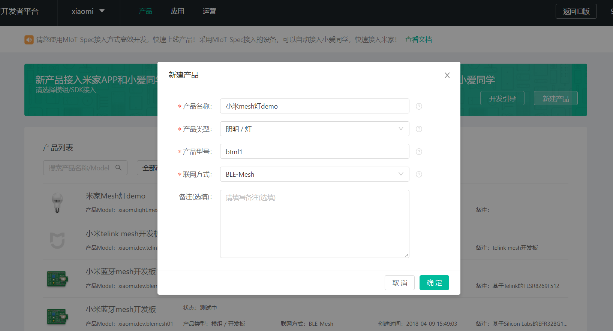
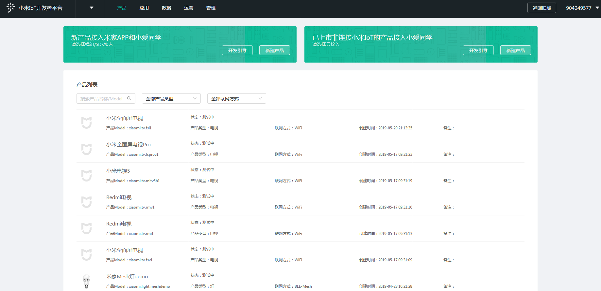
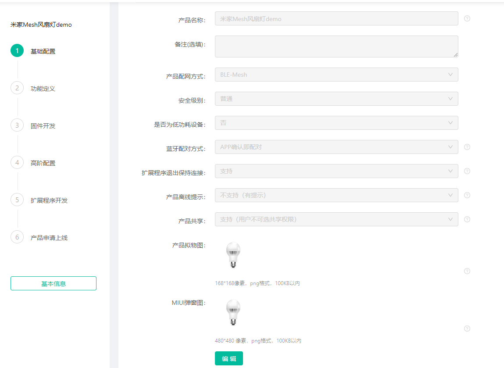
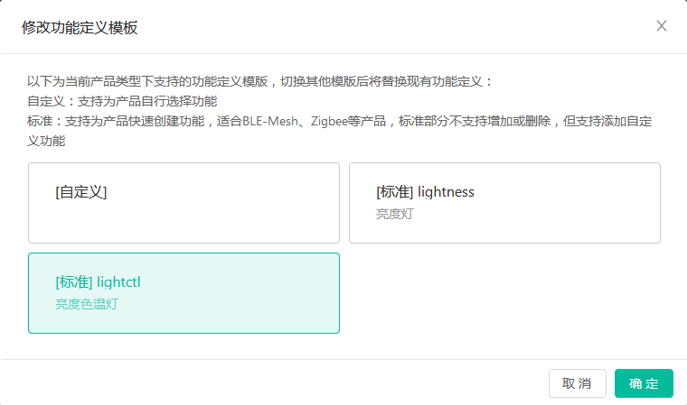
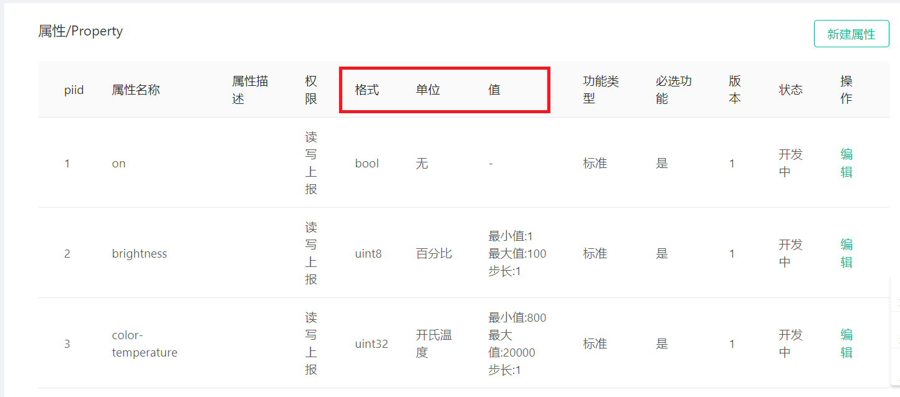

# 蓝牙 Mesh接入开发

*本文用于指导产品开发者实现蓝牙 Mesh产品接入*

<br/>

## 背景知识

### 设备Profile

小米蓝牙 Mesh系统会涉及到MIoT Spec和Mesh Spec两种Profile。

MIoT Spec是小米定义的产品应用层的功能规范，它对智能设备功能进行归类和统一，描述设备的功能和操作方法，并做了预定义。同样SIG也提供蓝牙 Mesh的应用层规范，如Mesh Model、Status、Message等，本文称为Mesh Spec。

可以简单理解为，MIoT Spec是小米定义并实现的设备描述规范，Mesh网关、米家APP 、小爱同学，AI大脑、米家服务器均采用这套规范对设备进行控制；Mesh Spec是SIG定义的蓝牙 Mesh应用层规范，用于蓝牙 Mesh设备之间进行相互通信。两种规范会在Mesh网关完成转换，如下图：


### 模组 + 固件SDK

开发者拿到的模组和固件SDK已经实现了小米蓝牙 Mesh的配网、配置、分组、IV更新等各种协议栈的功能，开发者只需要开发产品的应用功能即可。

设备重置：SDK并未强制规定设备的重置方法，但产品开发者必须自己定义设备的重置方法。例如对于照明设备，一般是快速开关5次重置设备，对于其他有按键的设备，可以通过长按5秒按键重置设备。

### 已支持芯片平台列表：

| 芯片品牌     | 芯片型号 | SDK                                                        | 资源                   |
| :----------- | :------- | :--------------------------------------------------------- | :--------------------- |
| Silicon Labs | BG13     | https://github.com/MiEcosystem/mijia_ble_mesh/tree/silabs  | Flash ~ 64K, RAM ~ 48K |
| Realtek      | RTL8762C | https://github.com/MiEcosystem/mijia_ble_mesh/tree/realtek | Flash ~ 80K, RAM ~ 48K |
| Telink       | TLSR825x | https://github.com/MiEcosystem/mijia_ble_mesh/tree/telink  | Flash ~ 24K, RAM ~ 20K  |


## 产品创建流程

登陆[小米IoT开发者平台](https://iot.mi.com/new/index.html)，请先阅读“开发引导”熟悉接入流程。

### 创建蓝牙 Mesh产品

如下图创建产品，创建后会生成Product ID（后文简称PID），PID需要写入到设备固件里面，因此需记录下来。**注意：联网方式一定要选择“BLE-Mesh”**，其他选项按照图片选择。产品model名由公司名+品类名+产品型号组合而成，例如xiaomi.light.btml1。

**Mesh模组第一次绑定后，模组中存储的证书链、Product ID和MAC会绑定在一起，即该模组的Product ID和MAC从此不可被更改。**



在如下产品管理界面里选择相应的Model。



基础配置页面确认**安全级别为低**，用户可以修改产品名称和产品图片，其他配置如图所示。一定要点击编辑按钮和确认按钮确认**配置被保存**。如果申请的pid不能被网关发现，请确认基础配置是否正确。



在“功能定义”中选择设备类型所需的模版。




为了简化操作，开发者平台提供了常见产品模板，如亮度灯、色温灯等。产品模板提供了常见产品的大部分功能需求，且模板的所有功能都对应了SIG Mesh Model，Mesh网关默认支持这些产品模板。

目前支持蓝牙 Mesh模板名称及功能说明如下：后续会逐步增多更多的模板

|           名称           |    模板中文描述    |
| :----------------------: | :----------------: |
|        lightness         |       亮度灯       |
|         lightctl         |     亮度色温灯     |
|      one-key-switch      |      单键开关      |
|      two-key-switch      |      双键开关      |
|      three-key-switch    |      三键开关      |
| power-consumption-outlet | 插座（带功耗参数） |


**用户一定要选择一个模板**，如果现有模板不能满足用户需求，可向产品经理提需求增加模板。用户在模板的基础上还可以添加标准Service和自定义Service。建议用户选用标准Service。因为小爱同学，AI大脑只能理解MIoT Spec的定义，这样定义后，功能可以被语音控制。


**注意：不要轻易修改属性中的详情页，尤其不要修改“格式”。** 如下图所示。如果格式为bool型，不允许修改为其他格式。如果属性为brighness，单位只能为百分比，有效值的范围为[1,100]，如果属性为color-temperature，单位只能为开氏温度，有效值的范围为[800,20000]。



**注意：目前对于模板外的Service（即Vendor model），产品必须保证只上报有意义的数据，保证上报的时间间隔，且在状态变化时再上报，不允许周期性调用publish，此部分先联系产品经理。**

消息上行时，Mesh网关会将Mesh Spec消息翻译成MIoT Spec消息，消息下行时，Mesh网关会将MIoT Spec消息翻译成Mesh Spec消息。如果用户自定义了Service，网关不会翻译，会通过Vendor Model透传此Service的Service ID、Property ID、Value（MIoT Spec定义），设备固件在Vendor Model里面解析、处理。

### MIoT Spec Instance ID

生成设备实例以后需要获取实例ID，也就是Service ID（siid）和Property ID（piid）。如果开发者自定义了Service，则需要记下自定义功能的siid和piid值，在后面的固件开发中会用到（Mesh模板自带的siid和piid，开发者无需关心）。**注意：自定义属性的格式不能超过4字节。**


### 小米蓝牙 Mesh模版

**本节内容涉及到Mesh Model与Miot Spec转换，只是用于加深固件开发者对二者的理解，可以略过本节内容不影响开发。**

小米蓝牙 Mesh模板实现了MIoT Spec与Mesh Model的映射关系。

以色温灯为例，色温灯模板中包含两个Element，结构如下所示：

| Element | SIG Model ID |         Description          |
| :-----: | :----------: | :--------------------------: |
|    0    |    0x1000    |     Generic OnOff Server     |
|    0    |    0x1300    |    Light Lightness Server    |
|    0    |  0x038f0000  |       MIOT Spec Server       |
|    0    |  0x038f0002  |         Mijia Server         |
|    1    |    0x1306    | Light CTL Temperature Server |

相应的service和property描述如下：

| siid  | Service Description | piid  | Property Description | format  |      access       |  range/enum   |    unit    |
| :---: | :-----------------: | :---: | :------------------: | :-----: | :---------------: | :-----------: | :--------: |
|   1   | Device Information  |   1   |     Manufacturer     | string  |       read        |               |            |
|   1   | Device Information  |   2   |        Model         | string  |       read        |               |            |
|   1   | Device Information  |   3   |    Serial-Number     | string  |       read        |               |            |
|   1   | Device Information  |   4   |  Firmware Revision   | string  |       read        |               |            |
|   2   |        Light        |   1   |    Switch Status     |  bool   | read write notify |  true/false   |            |
|   2   |        Light        |   2   |      Brightness      | uint8_t | read write notify |   [1,100,1]   | percentage |
|   2   |        Light        |   3   |  Color Temperature   | kelvin  | read write notify | [800,20000,1] |   kelvin   |

Mesh Spec和MIoT Spec间映射关系如下：

| Mesh Element | Mesh Model | Mesh Opcode | siid  | piid  |  MIoT Spec Method  |
| :----------: | :--------: | :---------: | :---: | :---: | :----------------: |
|      0       |   0x1000   |   0x8201    |   2   |   1   |   get_properties   |
|      0       |   0x1000   |   0x8202    |   2   |   1   |   set_properties   |
|      0       |   0x1000   |   0x8204    |   2   |   1   | properties_changed |
|      0       |   0x1300   |   0x824B    |   2   |   2   |   get_properties   |
|      0       |   0x1300   |   0x824C    |   2   |   2   |   set_properties   |
|      0       |   0x1300   |   0x824E    |   2   |   2   | properties_changed |
|      1       |   0x1306   |   0x8261    |   2   |   3   |   get_properties   |
|      1       |   0x1306   |   0x8264    |   2   |   3   |   set_properties   |
|      1       |   0x1306   |   0x8266    |   2   |   3   | properties_changed |

上述翻译工作由Mesh网关完成，设备端仅需关心Mesh Spec相关实现。

## 产品开发引导

### 开发之前

- 确认产品的功能能否适用于现在的小米蓝牙 Mesh接入技术。
- 申请Github mijia_ble_mesh私有工程的权限获取demo工程，参考格式见[常用信息-获取内测资源与能力](https://iot.mi.com/new/doc/general-information/whitelist-related.html)。
- 申请对应平台的模组。
- 准备网关。由于Mesh网关仍在不断的迭代更新，已上市的网关并不一定包含最新的功能。**推荐使用**yeelight语音助手，绑定到个人名下后联系小米开发人员，**升级到最新测试版本**（包含多项正在开发的最新功能）。
- 不论采用何种模组，demo工程中都默认指定了pid。此pid可以配合语音及App上的插件演示大部分功能。之后都需要**修改成厂商自己申请的pid**。并要了解，对于某个模组，第一次绑定之后，**pid和mac地址均不能改变**。
- 在调试期间，语音控制可能不能使用。请使用[设备调试助手](https://debugger.iot.mi.com/iot/guide)进行调试。右上角可以切换环境，如果正式环境没有被调式设备，可以切换预览环境尝试。同时可以使用自然语言模拟真实语音控制进行调试。

- 产品创建完成后，需要在旧版平台权限管理中的**测试白名单**添加小米账号才能通过米家APP搜索到设备。

### Realtek 模组开发指导

此工程实现了一个蓝牙 Mesh色温灯的基本功能。请首先阅读Readme。对此工程有疑问可以直接提交issue。

下载代码：运行`git clone --recursive https://github.com/MiEcosystem/mijia_ble_mesh -b realtek`

阅读文件夹下的《Development Guidance.pdf》，内有详细内容。

### Silicon Labs 模组开发指导

此工程实现了一个蓝牙 Mesh色温灯的基本功能。请首先阅读Readme。对此工程有疑问可以直接提交issue。

下载代码：运行`git clone --recursive https://github.com/MiEcosystem/mijia_ble_mesh -b silabs`

将此工程导入到Simiplicity Studio IDE。（File -> Import -> more import options -> General: Exist projects into workspace）

连接Segger Jlink RTT Viewer可以查看模组中log

**强烈推荐首先阅读Silicon Labs提供的蓝牙 Mesh文档及示例程序。** 本工程可以看作是基于标准蓝牙 Mesh工程的一个具体应用。

- 在project-name.isc文件填写设备信息并创建Element, Model。
- 初始化Model。
```
    /* SIG Model */
    mesh_lib_generic_server_register_handler(MESH_GENERIC_ON_OFF_SERVER_MODEL_ID,
                                            0,
                                            onoff_request,
                                            onoff_change);

    /* Vendor Model */
    gecko_cmd_mesh_vendor_model_init(PRIMARY_ELEM,
                                    XIAOMI_COMPANY_ID,
                                    VENDOR_SERVER_MODEL_MIOT_SPEC,
                                    1,
                                    sizeof(miot_spec_opcode_set),
                                    miot_spec_opcode_set);
```
- 把对应的Model进行配置。将新创建的Model绑定appkey。并打开新创建SIG Model的publish，Vendor Model没有此项配置。其他配置保持不变。注意这些配置只有在进行完小米Provision之后才能执行。请仔细阅读代码，不要修改其他配置，仿照已有的Model配置来配置新创建的Model。
```
    /* SIG Model and Vendor Model */
    gecko_cmd_mesh_test_bind_local_model_app(
        p_list->head[i].elem_idx,
        p_list->head[i].appkey_idx,
        p_list->head[i].vendor == 0 ? 0xFFFF : p_list->head[i].vendor,
        p_list->head[i].model)

    /* SIG Model Only */
    result = gecko_cmd_mesh_test_set_local_model_pub(PRIMARY_ELEM, 0, 0xFFFF, 0x1000, XIAOMI_GATEWAY_GROUP, DEFAULT_TTL, PUB_PERIOD(6, STEP_10SEC), 0, 0)->result;
    MI_ERR_CHECK(result);
```
- 实现每个SIG Model的回调函数。例如`onoff_reques`回调函数中根据`transition_ms`和`delay_ms`实现了对开关灯的硬件操作。根据`request_flags`决定是否要回复消息。按照特定的延时publish status。请仔细阅读代码，注意`mesh_lib_generic_server_response`和`mesh_lib_generic_server_publish`函数都是在timer的timeout回调中执行的。
```
    static void onoff_request(uint16_t model_id,
                                uint16_t element_index,
                                uint16_t client_addr,
                                uint16_t server_addr,
                                uint16_t appkey_index,
                                const struct mesh_generic_request *request,
                                uint32_t transition_ms,
                                uint16_t delay_ms,
                                uint8_t request_flags)
    {
        /* operation GPIO according to delay_ms and transition_ms */
        if (delay_ms > 0) {
            // TODO
        } else if (transition_ms > 0) {
            // TODO
        } else {
            // TODO
        }

        /* response status according to request_flags. use a timer to make mesh system stable, do not modify it */
        if (request_flags & MESH_REQUEST_FLAG_RESPONSE_REQUIRED) {
            gecko_cmd_hardware_set_soft_timer(TIMER_MS_2_TIMERTICK(rsp_delay), TIMER_ID_ONOFF_RSP, 1);

            /* call mesh_lib_generic_server_response when timeout */
            // TODO set parameters when timeout
        }

        /* Publish status to publish address. use a timer to make mesh system stable, do not modify it */
        gecko_cmd_hardware_set_soft_timer(TIMER_MS_2_TIMERTICK(pub_delay), TIMER_ID_ONOFF_PUB, 1);

        /* call mesh_lib_generic_server_publish when timeout */
        // TODO set parameters when timeout
    }
```
- 实现Vendor Model的回调函数，根据event的类型做合适的操作。
```
    static void process_mesh_vendor_model_recv_event(struct gecko_cmd_packet *evt)
    {
        struct gecko_msg_mesh_vendor_model_receive_evt_t event = evt->data.evt_mesh_vendor_model_receive;
        // TODO
    }
```
- 自定义重置方式，例如连续开关多次。
```
    if (GPIO_PinInGet(BSP_BUTTON0_PORT, BSP_BUTTON0_PIN) == 0 ||
        GPIO_PinInGet(BSP_BUTTON1_PORT, BSP_BUTTON1_PIN) == 0 ||
        mesh_stat.quick_reboot > QUICK_BOOT_TIMES) {
            // TODO
            initiate_factory_reset();
        }
```
- 如果需要实现Indication。
```
    // TODO
```
- 如果需要实现低功耗。
```
    // TODO
```

更多资料

* [UG103.14: BLE Fundamentals](https://www.silabs.com/documents/login/user-guides/ug103-14-fundamentals-ble.pdf)
* [UG136: Silicon Labs Bluetooth C
Application Developer's Guide](https://www.silabs.com/documents/login/user-guides/ug136-ble-c-soc-dev-guide.pdf)

* [QSG148: Getting Started with the Silicon
Labs Bluetooth Mesh Lighting
Demonstration](https://www.silabs.com/documents/login/quick-start-guides/qsg148-bluetooth-mesh-demo-quick-start-guide.pdf)
* [AN1098: Understanding the Silicon Labs
Bluetooth Mesh Lighting Demonstration](https://www.silabs.com/documents/login/application-notes/an1098-understanding-bluetooth-mesh-lighting-demo.pdf)

### OTA

目前只支持手机直连基于GATT做OTA，且固件必须经过验签，否则设备会忽略收到的OTA包。

固件上传前，按下图配置**固件设置**，并选择一个蓝牙 Mesh模组并保存(未在列表内芯片可以随便选一个)：


固件签名由米家服务器执行，开发者仅需将待升级固件（Firmware）及版本号上传至服务器，新版操作界面如下所示（要求必须使用新版界面操作）：


上传完成后，默认固件未签名，需手动申请签名，操作如下：


签名状态转换成“已签名”后，即可点击“开启测试”，用于开发者和内测用户下载新固件，操作如下：


如果是首次上传固件，上传完成后则必须配置**支持签名和HTTPS的最低版本**，例如设置的最低版本为1.2.0_0002，那么设备上的当前版本和待升级的版本，均必须大于1.2.0_0002。

最低版本设置目前仅支持在旧版界面上操作，如下所示：


最低版本号仅能在已经上传的版本号列表中选择，如下所示：


