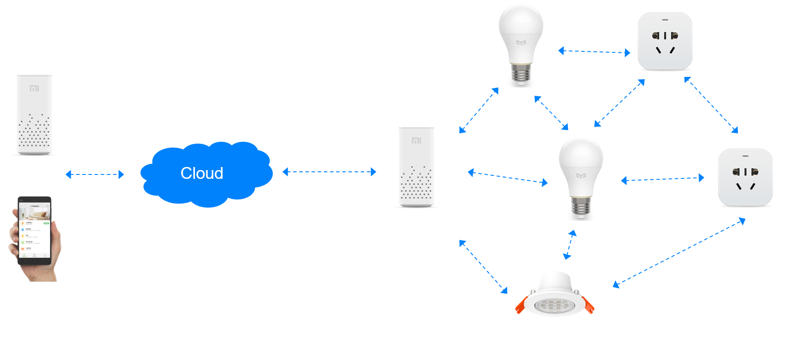

# 小米BLE Mesh接入介绍

*本文用于指导产品开发者了解小米BLE Mesh接入*

 

### 小米BLE Mesh接入特性介绍

- 智能音箱/网关是整个BLE Mesh系统的核心，控制消息都是音箱/网关发出的，暂时不支持Mesh子设备之间互相交互。推荐通过小爱同学语音来完成设备控制。目前支持的智能音箱/网关产品有：小米小爱智能闹钟、Yeelight智能语音助手、2019年5月份之后上市的全系小爱智能音箱。
- 与传统BLE接入相比，BLE Mesh接入可以提供消息下行功能，即网关发出消息到设备。BLE Mesh也具有更高级别的安全性。
- BLE Mesh接入与传统BLE接入不兼容，只能选择一种。
- BLE Mesh会使得所有的子设备组成一个网络，经过合理的布局和Mesh提供的转发功能，设备可以突破传统BLE接入距离的限制。
- 支持低功耗。

### 小米BLE Mesh模组介绍

- 默认支持Relay，Friend，Low Power功能，Proxy功能可选。
- 默认支持Generic OnOff Server Model, Generic Level Server Model, CTL Server Model, Lightness Server Model，Vendor Server Model。推荐使用标准Model。标准Model都支持Transition & Delay。Vendor Model需要在开放平台配置，可以进行数据透传，传输的有效数据最多为4 Bytes(int32)。
- 某些场景下需要Server端主动上报数据，Client端收到数据后必须回复，让Server端确认Client已经收到了数据。因此特别在Vendor Model中定义Indication和Indication Ack。此功能适合某些低功耗传感器类设备，只有数据上行。当需要发送数据时，设备从低功耗状态进入到正常状态并定时重复发送数据，当收到网关回复消息或定时器超时，会停止发送，并从正常状态进入到低功耗状态。
- 默认支持使用米家App进行分组，支持组控。
- 默认使用小米私有Provision方式进行入网，此方式保证了Mesh系统的安全性同时支持多网关漫游功能。智能音箱/网关和米家App都可以操作设备入网。
- 使用MIoT Spec定义应用层设备描述和功能定义规范，此时产品可以被小爱同学直接语音控制。详见小米IoT开发者平台。
- 用户慎重在需要消息下行时启用Low Power功能。在需要消息下行时，Low Power功能必须与Friend功能配合使用。启动Low Power功能可能会造成数据下行延时。启用此功能需首先与小米产品经理进行对接。
- 不建议用户修改模组里面关于Mesh的参数。这些参数已经经过米家团队的优化。
- BLE Mesh消息从网关到设备所需的平均时间大约为100ms。如果设备距离网关较远，需要多次转发，所需的时间还可能变长。
- 目前只支持GATT OTA功能。

### 小米BLE Mesh模组提供的API介绍

*通用介绍，不同平台具体定义可能会略有不同*

- 用户可以创建SIG Mesh Server Model或Vendor Server Model。
- 对于每一个Server Model：
  - 用户可以接收到Get/Set/Set Unacknowledged消息，并可以在回调中运行自己的操作。例如操作GPIO/PWM来开关灯。
  - 用户可以调用Status Ack接口来回复Set消息。
  - 用户可以根据Status变化来Publish消息。
  - 用户可以设置周期性的Publish。
- 提供重置模组的接口(类似于收到reset的操作)。用户需要自定义调用重置接口的方式，例如快速开关5次或者长按按键等。
- 提供触发Indication的接口。
- 提供进入和退出低功耗状态的接口。

## 产品创建和开发流程

请参考[小米BLE Mesh开发者指南](https://github.com/MiEcosystem/mijia_ble_mesh/blob/master/doc/Xiaomi-BLE-Mesh-Development.md)
