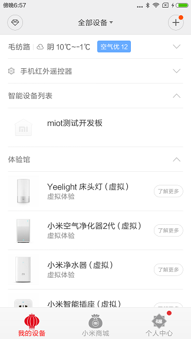
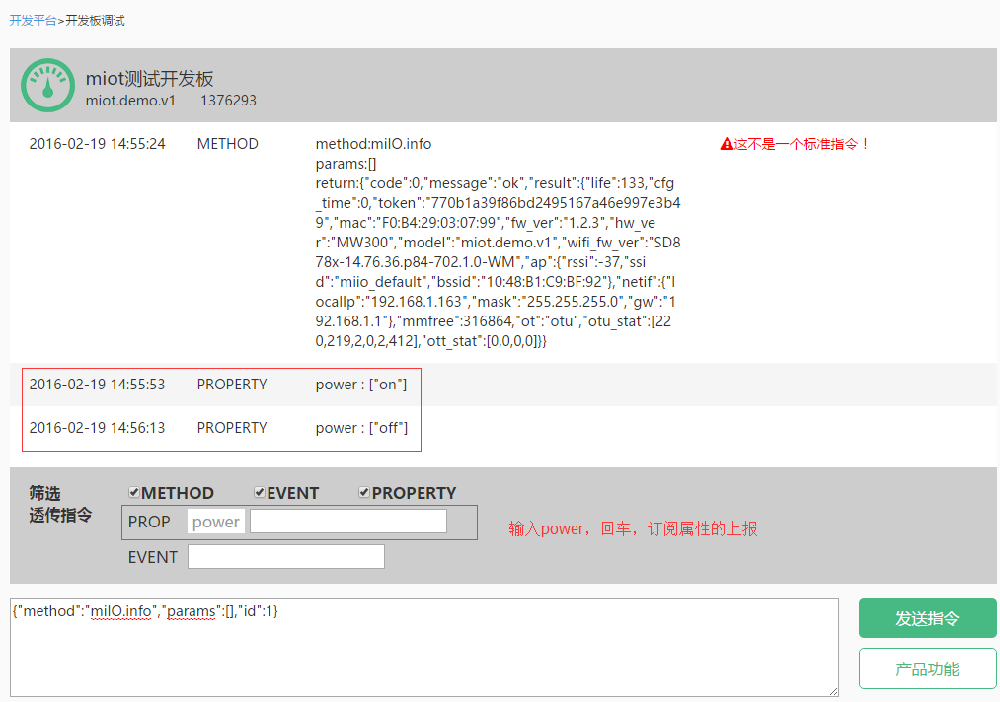

# WIFI-模组接入

模组接入方式适合于不具备通讯能力的产品，需要将小米智能模组嵌入现有产品的电路中。

## WIFI模组硬件简介

小米MHCW03P模组开发板外观：


管脚图：


原理图：


## 设备固件研发

你只需要通过串口(115200 8N1)即可与小米模组进行通信，如图：


通过SecureCRT工具打开串口，输入help既可以得到支持的串口命令列表。

## 常用的串口命令


## 利用开放平台调试 第一个HELLO WORLD

首先你需要在[开放平台](https://open.home.mi.com/) 注册成为开发者。并且使用相同的小米账号，登录[小米智能家庭APP](http://home.mi.com/index.html)。

开放平台里面介绍了一些基本概念，请务必提前阅读。

在开始调试之前，你需要在开放平台里面申请一个新产品，审批通过后，获得产品的model。（由于ssid不能超过32字节，model将限制为23个字节以内）

你可以在app_thread里面设置产品的model

```
>model miot.demo.v1
<ok
```

(重复写入psm对flash寿命有害，你可以看到代码里面做了只写一次psm的保护)

打开智能家庭APP，按照提示绑定设备到当前的账号

  

然后回到开放平台，你就可以向模组发送RPC命令了。

  


开放平台还可以订阅设备上报的属性、事件。属性可以用于刷新APP界面（如温度、空气质量值），事件可以用于push（如故障、报警信息）



**miIO.info 是一个基本命令，你随时都可以向设备发送，查询设备的基本信息**

## Profile 协议规范

在开始编写你的第一个方法之前，需要先了解一下基本规范。开始之前确保你已经阅读了[开放平台](https://open.home.mi.com/) 里面的相关介绍。

### 关于[JSON RPC](http://json-rpc.org/wiki/specification)

变量，函数的命令风格遵循[GNU-C](https://www.gnu.org/prep/standards/)风格，小写字母，下划线分隔就可以了。（天呐不要驼峰式...）

请参考示例 [空气净化器举例](../md_images/设备profile模板 - 空气净化器举例.pdf)


## 模组采购与设备量产


## FAQ:

Q：模组PCB天线结构上有什么要求？

A：PCB天线需要外露，附近1CM需要净空。天线下方不要有PCB板（如开发板所示）。整机组装后天线尽量靠近外壳面板，不要被大块金属遮挡（如电机、水箱之类）
