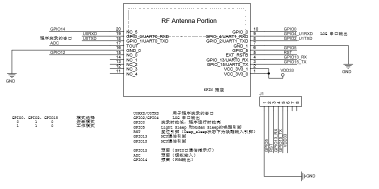
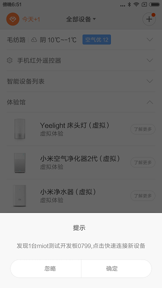

# WIFI-模组接入

模组接入方式适合于不具备通讯能力的产品，需要将小米智能模组嵌入现有产品的电路中。

## WIFI模组硬件简介

小米MHCW03P模组开发板外观：


管脚图：


原理图：



## 设备固件研发

你只需要通过串口(115200 8N1)即可与小米模组进行通信，如图：


通过SecureCRT工具打开串口，输入help既可以得到支持的串口命令列表。


## 常用的串口命令


## 利用开放平台调试 第一个HELLO WORLD

首先你需要在[开放平台](https://open.home.mi.com/) 注册成为开发者。并且使用相同的小米账号，登录[小米智能家庭APP](http://home.mi.com/index.html)。

开放平台里面介绍了一些基本概念，请务必提前阅读。

在开始调试之前，你需要在开放平台里面申请一个新产品，审批通过后，获得产品的model。（由于ssid不能超过32字节，model将限制为23个字节以内）

你可以在MCU上电后，设置产品的model

```
>model miot.demo.v1
<ok
```

(重复写入psm对flash寿命有害，你可以看到代码里面做了只写一次psm的保护)

打开智能家庭APP，按照提示绑定设备到当前的账号

  

然后回到开放平台，你就可以向模组发送RPC命令了。

  


开放平台还可以订阅设备上报的属性、事件。属性可以用于刷新APP界面（如温度、空气质量值），事件可以用于push（如故障、报警信息）


**miIO.info 是一个基本命令，你随时都可以向设备发送，查询设备的基本信息**

## 通过开放平台管理MCU固件

- 版本号上报

MCU上电后，设置产品的mcu_version。 MCU版本号为四位数字，你可以在开放平台上传并设置最新的版本号。

```
>mcu_version 1000
<ok
```

- 固件上传与CRC验证

MCU固件需要尾部添加CRC后再上传，你可以使用我们提供的[工具](../md_images/crc32)自行添加（甚至可以集成到你的编译脚本里面）。

- 升级流程说明

 1. MIIO模组通过http连接下载固件，同MCU通过Xmodem协议进行数据传输。 

 2. 传输数据包为128B，加上Header,Packet Number,CherckSum共计134字节。 

 3. 传输最后一个包时，如果有效数据不足128B，则补齐为1A FF FF FF…若128B,则补加一个数据包，数据为1A FF FF

 4. Xmodem传输数据握手时，第一个NAK或C用于确定校验方式，第二个NAK或C开始传输数据。因此超时时间不宜过长。 


- xmodem协议

你可以下载[xmodem源代码](../md_images/xmodem.c)，然后继承到你的主控MCU当中。

*如果你使用的是Atmel系列的mcu，可以联系我们(miot-open@xiaomi.com)提供例程*

- 通过开放平台调试

编译好固件，添加CRC32，上传，获取固件的url后，你可以像设备发送如下命令来启动MCU OTA过程：

```
{"method":"miIO.ota","params": {"mcu_url":"xxxxxxx"},"id":1}
```

## Profile 协议规范

在开始编写你的第一个方法之前，需要先了解一下基本规范。开始之前确保你已经阅读了[开放平台](https://open.home.mi.com/) 里面的相关介绍。

### 关于[JSON RPC](http://json-rpc.org/wiki/specification)

变量，函数的命令风格遵循[GNU-C](https://www.gnu.org/prep/standards/)风格，小写字母，下划线分隔就可以了。（天呐不要驼峰式...）

请参考示例 [空气净化器举例](../md_images/设备profile模板 - 空气净化器举例.pdf)

## 硬件设计规约

在跑通以上软件以后，相信你已经有信心准备投板生产的你设备了。在开始之前，你需要了解一些通用的设计规约

- WIFI指示灯

你需要自己定义自己的WIFI重置按键与WIFI指示灯。小米产品指示灯规范如下：

```
双色LED灯方案【强烈建议】
橙色指示灯和蓝色指示灯
状态	双色LED闪烁方式
等待快连中	橙灯闪烁（橙0.1s 灭0.2s）
快连中、连网中、掉线重连中	蓝灯闪烁。（蓝0.1s 灭0.2s）
成功连接到路由器	蓝灯长亮
升级中	橙灯慢闪。（橙0.2s 灭0.8s）
```

```
单色LED灯方案【迫不得已】
颜色不指定，可根据外观选择
状态	双色LED闪烁方式
等待快连中	慢闪（亮0.2s灭0.8s）
快连中、连网中、掉线重连中	快闪（亮0.1s灭0.2s）
成功连接到路由器	长亮
升级中	双闪（亮0.1s灭0.2s亮0.1s灭0.8s）
```

通过net命令可以查询到网络连接状态

```
>net
<uap
```

- WIFI重置

WLAN重置是指断开当前WLAN连接，使芯片重启后处在等待块连的状态中的操作。MIIO设计规约要求必须预留一个复位按钮，按钮可以设计为以下两种中的一种：

1. 单独的隐藏按钮（类似路由器的复位孔）

2. 与其他按键复用

按钮被长按5秒后，触发设备WLAN重置操作。

通过串口命令可以重置WIFI连接，解绑用户账号的关系

```
>restore
<ok
```

- 进入测试模式

为产品整机预留一个进入测试模式的方法，可以帮助快速进行产线上的联网。也可以在用户遇到联网困难时，提供最后的解决办法。例如：

按住开关键上电，并保持5s以上，发送串口命令。厂测模式的热点名为 miio_default ，密码 0x82562647

```
factory
ok
```

- 低功耗模式唤醒管脚

MIIO模组在空闲时会进入低功耗模式。设计上，可以用一个管脚与MIIO模组的唤醒管脚相连，当MCU需要MIIO立即响应时，把这个管脚拉低即可。

- 串口焊孔、焊盘

为方便调试，应该在PCB主板上留有如下过孔：

1. WIFI模块的UART0 RX/TX/GND，供输出WIFI模块的调试信息。

2. WIFI模块的UART1 RX/TX/GND，供查看WIFI模块与MCU之间的通信。

3. WIFI模块的boot pin/GND，boot pin拉低上电，WIFI模块进入串口烧写模式。

4. pin与GND做成可被跳线短接的相邻过孔

5. MCU的调试输出，如果MCU提供了运行时的调试输出，应该提供相应的过孔

- 贴片位置

PCB天线需要外露，附近1CM需要净空。天线下方不要有PCB板（如开发板所示）。整机组装后天线尽量靠近外壳面板，不要被大块金属遮挡（如电机、水箱之类）

- 按钮操作的上报

产品的任何实体按钮，在被按下时，可以用prop命令将这一操作作为属性上报给wifi芯片。button_pressed是一个保留的属性，在产品量产后能知道用户如何操作了你的设备，通常对售后很有帮助。

>props button_pressed "power"
<ok


## 模组采购与设备量产

当你准备量产你的产品，需要采购模组时，需要签订采购框架协议与NDA协议。我们同时会提供模组的规格书、报价单、SRRC认证报告、ROHS等认证报告。发邮件到miot-open@xiaomi.com ，我们会有专人与你联系。

## FAQ:


